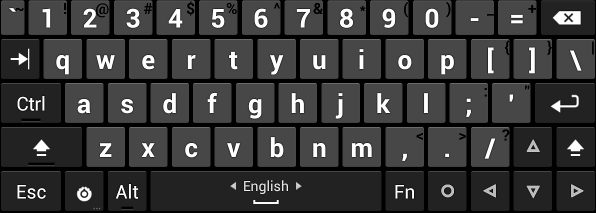

# Hacked Keyboard GEM

## Fork Update (2024-2026) ##

**Modernized:** Upgraded to **Target SDK 34** (Android 14), **Compile SDK 35**, **AGP 9.1.1**, and **Gradle 9.4.1**. All legacy resource errors and namespace issues have been resolved to meet modern Play Store requirements.

**Modern AMOLED Theme:** A premium black theme optimized for modern OLED displays. Keys feature a semi-transparent "frosted glass" effect, modern rounded corners, and sleek custom **Cyan LED indicators** for toggle keys (Ctrl, Alt, Shift). Includes a toggle to **Invert menu theme color** for better accessibility.

**Integrated Test Area:** The main application screen now includes an expandable **Test fields** section. Unlike the original version, you can now verify keyboard behavior across different input types (Plain Text, Password, Email, Numeric, etc.) directly within the app.

**Macro Menu Popup:** Enhanced macro functionality with a dedicated popup menu. This allows for storing and quickly selecting multiple custom text sequences or control characters directly from the suggestion bar.

**Improved Haptics:** The "Vibrate on keypress" engine has been completely rewritten using the modern Android **VibrationEffect** API. This provides a more responsive, tactile, and "crisp" haptic feedback.

**Smart Auto-Correction & Typing:**
- **Advanced Auto-Correction:** Offers three distinct modes: **Off**, **Balanced**, and **Full**.
- **Auto-Capitalization with Override:** Pressing 'Shift' once manually disables auto-cap for that specific word.
- **Auto-Punctuate:** Double-tapping the spacebar automatically inserts a period followed by a space.
- **Reverse Tab Key:** New logic to handle reversed navigation in complex web forms.

**Enhanced Language & Dictionary Support:**
- **Dictionary Statistics:** Displays word counts for **Auto-Dictionary** and **System User Dictionary**, plus file size in KB/MB for external packs.
- **User Dictionary Support:** Seamless integration with the native Android **UserDictionary** provider.
- **Search Bar:** Integrated search in the "Input Language" selection page.
- **AnySoftKeyboard Support:** Full compatibility with [AnySoftKeyboard dictionary packs](https://github.com/AnySoftKeyboard/AnySoftKeyboard).

**Settings Portability:**
- **Import/Export:** Backup and restore your entire configuration via JSON files.

## Project Resources ##

This version is maintained at: **[GitHub: oblus/hackerskeyboard](https://github.com/oblus/hackerskeyboard)**

Having problems? Check the **[GEM Issue Tracker](https://github.com/oblus/hackerskeyboard/issues)** for this fork.

## Original Readme ##

### Overview ###

**WARNING:** *This is a rather ancient project that was originally developed back in 2011 based on the Android 2.3 (Gingerbread) AOSP keyboard. While it still works as-is for many users, it would need some major rewrites to work with newer APIs, and some features such as language switching or popup keys don't work right on modern Android systems.*

Are you missing the key layout you're used to from your computer when using an Android device? This software keyboard has separate number keys, punctuation in the usual places, and arrow keys. It is based on the AOSP Gingerbread soft keyboard, so it supports multitouch for the modifier keys.

This keyboard is especially useful if you use ConnectBot for SSH access. It provides working Tab/Ctrl/Esc keys, and the arrow keys are essential for devices such as the Xoom tablet or Nexus S that don't have a trackball or D-Pad.

The supported keyboard layouts include Armenian (Հայերեն), Arabic (العربية), British (en_GB), Bulgarian (български език), Czech (Čeština), Danish (dansk), Carpalx English (language "en-CX"), Dvorak English (language "en-DV"), English (QWERTY), Finnish (Suomi), French (Français, AZERTY), German (Deutsch, QWERTZ), German Neo2 (Deutsch, language "de-NE"), Greek (ελληνικά), Hebrew (עبریة), Hungarian (Magyar), Italian (Italiano), Lao (ພາສາລາວ), Norwegian (Norsk bokmål), Persian (فارسی), Portuguese (Português), Romanian (Română), Russian (Русский), Russian phonetic (Русский, ru-rPH), Serbian (Српски), Slovak (Slovenčina), Slovenian (Slovenščina)/Bosnian/Croatian/Latin Serbian, Spanish (Español, Español Latinoamérica), Swedish (Svenska), Tamil (தமிழ்), Thai (ไทย), Turkish (Türkçe), and Ukrainian (українська мова).

To install the original version, get **[Hacker's Keyboard](https://play.google.com/store/apps/details?id=org.pocketworkstation.pckeyboard)** from the Play Store, plus optional [dictionary packs](https://play.google.com/store/apps/developer?id=Klaus+Weidner).

### Additional resources ###

See the **[Original Release Notes](https://github.com/klausw/hackerskeyboard/wiki/ReleaseNotes)** for historical changes.

Having problems with the original version? See the **[User's Guide](https://github.com/klausw/hackerskeyboard/wiki/UsersGuide)** and **[FAQ](https://github.com/klausw/hackerskeyboard/wiki/FrequentlyAskedQuestions)**.

Application developers: see [the page about keyboard support in applications](https://github.com/klausw/hackerskeyboard/wiki/KeyboardSupportInApplications) if you want to enable the additional keys in your Android application.

